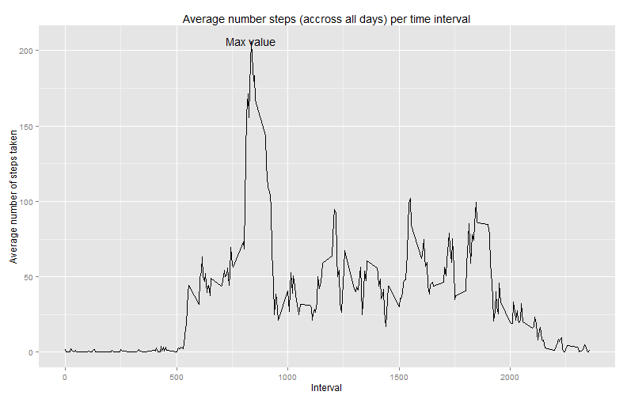
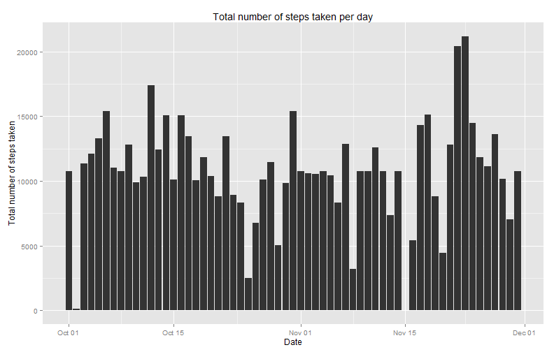
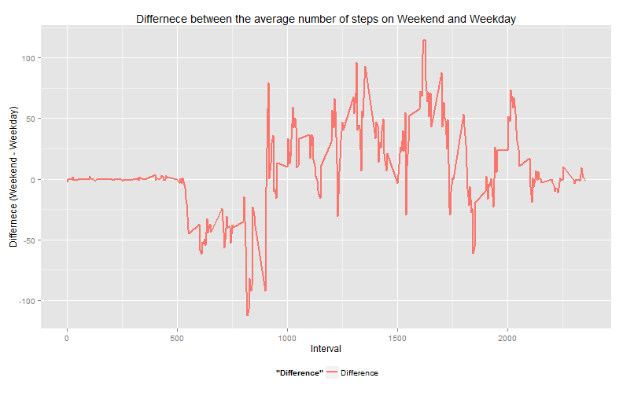

# Reproducible Research: Peer Assessment 1


**Background:** This analysis makes use of data from a personal activity monitoring device.This device collects data at 5 minute intervals through out the day. The data consists of two months of data from an anonymous individual collected during the months of October and November, 2012 and include the number of steps taken in 5 minute intervals each day.
*****

**Overview:** The following document provides insight on:  
1. Loading and preprocessing the data: Where the data is loaded, cleaned and made ready to analyze.   
2. What is mean total number of steps taken per day?   
3. What is the average daily activity pattern?   
4. Strategy to handle missing values   
5. Are there differences in activity patterns between weekdays and weekends?  
*****


## Loading and preprocessing the data
This repository contains the dataset, hence there is not need to download 
it seperatly. The following code block downloads the activity.csv data into R

```r
library(plyr)
library(ggplot2)
library(xtable)

zipFile <- "activity.zip"
unzip(zipFile)
activityData <- read.csv("activity.csv")
```

Let's analyze the imported activityData data.frame

```r
print(str(activityData))
```

```
## 'data.frame':	17568 obs. of  3 variables:
##  $ steps   : int  NA NA NA NA NA NA NA NA NA NA ...
##  $ date    : Factor w/ 61 levels "2012-10-01","2012-10-02",..: 1 1 1 1 1 1 1 1 1 1 ...
##  $ interval: int  0 5 10 15 20 25 30 35 40 45 ...
## NULL
```

After loading the dataset, it is apparent that the $date variable is of class
"factor". Hence, the subsequent steps will convert it to a "date" type.  
**Note:** Missing values coded as 'NA' are not handelled here and will be handelled in subsequent steps.

```r
activityData$date <-as.Date(activityData$date)
print(str(activityData))
```

```
## 'data.frame':	17568 obs. of  3 variables:
##  $ steps   : int  NA NA NA NA NA NA NA NA NA NA ...
##  $ date    : Date, format: "2012-10-01" "2012-10-01" ...
##  $ interval: int  0 5 10 15 20 25 30 35 40 45 ...
## NULL
```
Now, we have a clean data set to work with.
*****

## What is mean total number of steps taken per day?

Plotting the total steps taken per day

```r
activityData2 <-ddply(activityData, ~date , summarize, 
                      sum_steps = sum(steps),
                      mean_steps = mean(steps),
                      median_steps = median(steps)) 
g <- ggplot(activityData2, aes(x = date, y = sum_steps))
g <- g + geom_bar(stat="identity")
g <- g + xlab("Date") + ylab("Total number of steps taken") + labs(title = "Total number of steps taken per day")
print(g)
```

 

Displaying the mean and median steps taken each day

```r
print(activityData2)
```

```
##          date sum_steps mean_steps median_steps
## 1  2012-10-01        NA         NA           NA
## 2  2012-10-02       126     0.4375            0
## 3  2012-10-03     11352    39.4167            0
## 4  2012-10-04     12116    42.0694            0
## 5  2012-10-05     13294    46.1597            0
## 6  2012-10-06     15420    53.5417            0
## 7  2012-10-07     11015    38.2465            0
## 8  2012-10-08        NA         NA           NA
## 9  2012-10-09     12811    44.4826            0
## 10 2012-10-10      9900    34.3750            0
## 11 2012-10-11     10304    35.7778            0
## 12 2012-10-12     17382    60.3542            0
## 13 2012-10-13     12426    43.1458            0
## 14 2012-10-14     15098    52.4236            0
## 15 2012-10-15     10139    35.2049            0
## 16 2012-10-16     15084    52.3750            0
## 17 2012-10-17     13452    46.7083            0
## 18 2012-10-18     10056    34.9167            0
## 19 2012-10-19     11829    41.0729            0
## 20 2012-10-20     10395    36.0938            0
## 21 2012-10-21      8821    30.6285            0
## 22 2012-10-22     13460    46.7361            0
## 23 2012-10-23      8918    30.9653            0
## 24 2012-10-24      8355    29.0104            0
## 25 2012-10-25      2492     8.6528            0
## 26 2012-10-26      6778    23.5347            0
## 27 2012-10-27     10119    35.1354            0
## 28 2012-10-28     11458    39.7847            0
## 29 2012-10-29      5018    17.4236            0
## 30 2012-10-30      9819    34.0938            0
## 31 2012-10-31     15414    53.5208            0
## 32 2012-11-01        NA         NA           NA
## 33 2012-11-02     10600    36.8056            0
## 34 2012-11-03     10571    36.7049            0
## 35 2012-11-04        NA         NA           NA
## 36 2012-11-05     10439    36.2465            0
## 37 2012-11-06      8334    28.9375            0
## 38 2012-11-07     12883    44.7326            0
## 39 2012-11-08      3219    11.1771            0
## 40 2012-11-09        NA         NA           NA
## 41 2012-11-10        NA         NA           NA
## 42 2012-11-11     12608    43.7778            0
## 43 2012-11-12     10765    37.3785            0
## 44 2012-11-13      7336    25.4722            0
## 45 2012-11-14        NA         NA           NA
## 46 2012-11-15        41     0.1424            0
## 47 2012-11-16      5441    18.8924            0
## 48 2012-11-17     14339    49.7882            0
## 49 2012-11-18     15110    52.4653            0
## 50 2012-11-19      8841    30.6979            0
## 51 2012-11-20      4472    15.5278            0
## 52 2012-11-21     12787    44.3993            0
## 53 2012-11-22     20427    70.9271            0
## 54 2012-11-23     21194    73.5903            0
## 55 2012-11-24     14478    50.2708            0
## 56 2012-11-25     11834    41.0903            0
## 57 2012-11-26     11162    38.7569            0
## 58 2012-11-27     13646    47.3819            0
## 59 2012-11-28     10183    35.3576            0
## 60 2012-11-29      7047    24.4688            0
## 61 2012-11-30        NA         NA           NA
```
*****

## What is the average daily activity pattern?

Plotting the average number steps (accross all days) per time interval

```r
activityData3 <-ddply(activityData, ~interval , summarize, 
                     mean_steps = mean(steps, na.rm = TRUE))
yMax<- max(activityData3[,2])
xMax <- activityData3[which.max(activityData3[,2]),1]
g <- ggplot(activityData3, aes(x = interval, y = mean_steps))
g <- g + geom_line()
labelValue <- "Max value"
g <- g + annotate("text", x=xMax, y=yMax, label=labelValue)
g <- g + xlab("Interval") + ylab("Average number of steps taken") + labs(title = "Average number steps (accross all days) per time interval")
print(g)
```

 

>Hence, the maximum value occured at interval 835 and has the value of 206.169811320755. This is illustrated in the above graph with the annotation 'Max value' 
</br>
*****

## Imputing missing values

### Strategy for dealing with missing values
Finding the total number of rows with missing values (coded as NA).

```r
summary(activityData)
```

```
##      steps            date               interval   
##  Min.   :  0.0   Min.   :2012-10-01   Min.   :   0  
##  1st Qu.:  0.0   1st Qu.:2012-10-16   1st Qu.: 589  
##  Median :  0.0   Median :2012-10-31   Median :1178  
##  Mean   : 37.4   Mean   :2012-10-31   Mean   :1178  
##  3rd Qu.: 12.0   3rd Qu.:2012-11-15   3rd Qu.:1766  
##  Max.   :806.0   Max.   :2012-11-30   Max.   :2355  
##  NA's   :2304
```


From this we see that NA's only exist in the $steps variable and that there are 2304 of them which constitues for 13.1148 %.

Since, the total number of missing values are not that significant, let us use the mean of the 5 minute interval to replace the missing value. In this way, there is no impact to the overall statistics.

```r
tidyData<- activityData
tidyData[is.na(tidyData[, 1]), 1] <- with(tidyData, tapply(steps, interval, mean, na.rm = TRUE))

summary(tidyData)
```

```
##      steps            date               interval   
##  Min.   :  0.0   Min.   :2012-10-01   Min.   :   0  
##  1st Qu.:  0.0   1st Qu.:2012-10-16   1st Qu.: 589  
##  Median :  0.0   Median :2012-10-31   Median :1178  
##  Mean   : 37.4   Mean   :2012-10-31   Mean   :1178  
##  3rd Qu.: 27.0   3rd Qu.:2012-11-15   3rd Qu.:1766  
##  Max.   :806.0   Max.   :2012-11-30   Max.   :2355
```

As you can see above all the 2304 NA's are gone, but the summary statistics of the data set are still the same.

### Analyzing the tidy data set 

Plotting the total steps taken each day with the tidyData

```r
tidyData2 <-ddply(tidyData, ~date , summarize, 
                      sum_steps = sum(steps),
                      mean_steps = mean(steps),
                      median_steps = median(steps)) 
g <- ggplot(tidyData2, aes(x = date, y = sum_steps))
g <- g + geom_bar(stat="identity")
g <- g + xlab("Date") + ylab("Total number of steps taken") + labs(title = "Total number of steps taken per day")
print(g)
```

 

Displaying the mean and median steps taken each day

```r
mrg <- merge(activityData2, tidyData2, by = "date", suffixes = c(".orig", ".tidy"))
print(mrg[,c(1,3,6)])
```

```
##          date mean_steps.orig mean_steps.tidy
## 1  2012-10-01              NA         37.3826
## 2  2012-10-02          0.4375          0.4375
## 3  2012-10-03         39.4167         39.4167
## 4  2012-10-04         42.0694         42.0694
## 5  2012-10-05         46.1597         46.1597
## 6  2012-10-06         53.5417         53.5417
## 7  2012-10-07         38.2465         38.2465
## 8  2012-10-08              NA         37.3826
## 9  2012-10-09         44.4826         44.4826
## 10 2012-10-10         34.3750         34.3750
## 11 2012-10-11         35.7778         35.7778
## 12 2012-10-12         60.3542         60.3542
## 13 2012-10-13         43.1458         43.1458
## 14 2012-10-14         52.4236         52.4236
## 15 2012-10-15         35.2049         35.2049
## 16 2012-10-16         52.3750         52.3750
## 17 2012-10-17         46.7083         46.7083
## 18 2012-10-18         34.9167         34.9167
## 19 2012-10-19         41.0729         41.0729
## 20 2012-10-20         36.0938         36.0938
## 21 2012-10-21         30.6285         30.6285
## 22 2012-10-22         46.7361         46.7361
## 23 2012-10-23         30.9653         30.9653
## 24 2012-10-24         29.0104         29.0104
## 25 2012-10-25          8.6528          8.6528
## 26 2012-10-26         23.5347         23.5347
## 27 2012-10-27         35.1354         35.1354
## 28 2012-10-28         39.7847         39.7847
## 29 2012-10-29         17.4236         17.4236
## 30 2012-10-30         34.0938         34.0938
## 31 2012-10-31         53.5208         53.5208
## 32 2012-11-01              NA         37.3826
## 33 2012-11-02         36.8056         36.8056
## 34 2012-11-03         36.7049         36.7049
## 35 2012-11-04              NA         37.3826
## 36 2012-11-05         36.2465         36.2465
## 37 2012-11-06         28.9375         28.9375
## 38 2012-11-07         44.7326         44.7326
## 39 2012-11-08         11.1771         11.1771
## 40 2012-11-09              NA         37.3826
## 41 2012-11-10              NA         37.3826
## 42 2012-11-11         43.7778         43.7778
## 43 2012-11-12         37.3785         37.3785
## 44 2012-11-13         25.4722         25.4722
## 45 2012-11-14              NA         37.3826
## 46 2012-11-15          0.1424          0.1424
## 47 2012-11-16         18.8924         18.8924
## 48 2012-11-17         49.7882         49.7882
## 49 2012-11-18         52.4653         52.4653
## 50 2012-11-19         30.6979         30.6979
## 51 2012-11-20         15.5278         15.5278
## 52 2012-11-21         44.3993         44.3993
## 53 2012-11-22         70.9271         70.9271
## 54 2012-11-23         73.5903         73.5903
## 55 2012-11-24         50.2708         50.2708
## 56 2012-11-25         41.0903         41.0903
## 57 2012-11-26         38.7569         38.7569
## 58 2012-11-27         47.3819         47.3819
## 59 2012-11-28         35.3576         35.3576
## 60 2012-11-29         24.4688         24.4688
## 61 2012-11-30              NA         37.3826
```

```r
print(mrg[,c(1,4,7)])
```

```
##          date median_steps.orig median_steps.tidy
## 1  2012-10-01                NA             34.11
## 2  2012-10-02                 0              0.00
## 3  2012-10-03                 0              0.00
## 4  2012-10-04                 0              0.00
## 5  2012-10-05                 0              0.00
## 6  2012-10-06                 0              0.00
## 7  2012-10-07                 0              0.00
## 8  2012-10-08                NA             34.11
## 9  2012-10-09                 0              0.00
## 10 2012-10-10                 0              0.00
## 11 2012-10-11                 0              0.00
## 12 2012-10-12                 0              0.00
## 13 2012-10-13                 0              0.00
## 14 2012-10-14                 0              0.00
## 15 2012-10-15                 0              0.00
## 16 2012-10-16                 0              0.00
## 17 2012-10-17                 0              0.00
## 18 2012-10-18                 0              0.00
## 19 2012-10-19                 0              0.00
## 20 2012-10-20                 0              0.00
## 21 2012-10-21                 0              0.00
## 22 2012-10-22                 0              0.00
## 23 2012-10-23                 0              0.00
## 24 2012-10-24                 0              0.00
## 25 2012-10-25                 0              0.00
## 26 2012-10-26                 0              0.00
## 27 2012-10-27                 0              0.00
## 28 2012-10-28                 0              0.00
## 29 2012-10-29                 0              0.00
## 30 2012-10-30                 0              0.00
## 31 2012-10-31                 0              0.00
## 32 2012-11-01                NA             34.11
## 33 2012-11-02                 0              0.00
## 34 2012-11-03                 0              0.00
## 35 2012-11-04                NA             34.11
## 36 2012-11-05                 0              0.00
## 37 2012-11-06                 0              0.00
## 38 2012-11-07                 0              0.00
## 39 2012-11-08                 0              0.00
## 40 2012-11-09                NA             34.11
## 41 2012-11-10                NA             34.11
## 42 2012-11-11                 0              0.00
## 43 2012-11-12                 0              0.00
## 44 2012-11-13                 0              0.00
## 45 2012-11-14                NA             34.11
## 46 2012-11-15                 0              0.00
## 47 2012-11-16                 0              0.00
## 48 2012-11-17                 0              0.00
## 49 2012-11-18                 0              0.00
## 50 2012-11-19                 0              0.00
## 51 2012-11-20                 0              0.00
## 52 2012-11-21                 0              0.00
## 53 2012-11-22                 0              0.00
## 54 2012-11-23                 0              0.00
## 55 2012-11-24                 0              0.00
## 56 2012-11-25                 0              0.00
## 57 2012-11-26                 0              0.00
## 58 2012-11-27                 0              0.00
## 59 2012-11-28                 0              0.00
## 60 2012-11-29                 0              0.00
## 61 2012-11-30                NA             34.11
```
>Hence, as designed, the added data does not affect the overall statistics of the data set, however, the mean/median for perticular days are affected.
<br/>

*****

## Are there differences in activity patterns between weekdays and weekends?

```r
tidyData3<- tidyData
#tidyData3$Day <- weekdays(tidyData3$date)
tidyData3$DayType <- ifelse(!(weekdays(tidyData3$date) %in% c('Saturday','Sunday')), "Weekday", "Weekend")
```

Displayed below is a panel plot containing a time series plot of the 5-minute interval (x-axis) and the average number of steps taken, averaged across all weekday days or weekend days (y-axis).

```r
tidyData4 <-ddply(tidyData3, ~interval+DayType , summarize, 
                     mean_steps = mean(steps, na.rm = TRUE))
g <- ggplot(tidyData4, aes(x = interval, y = mean_steps))
g <- g + geom_line()
g <- g + facet_grid(DayType~.)
g <- g + xlab("Interval") + ylab("Average number of steps taken") + labs(title = "Average number of steps taken per interval on weekdays vs. weekends")
print(g)
```

 

Let's analyze the difference between weekends and weekdays

```r
tidyData4 <-ddply(tidyData3, ~interval+DayType , summarize, 
                     mean_steps = mean(steps, na.rm = TRUE))
g <- ggplot(tidyData4, aes(x = interval, y = mean_steps))
g <- g + stat_summary(aes(colour="Difference",shape="difference",group=1), fun.y=diff, geom="line", size=1)
g <- g + theme(legend.position="bottom")
g <- g + xlab("Interval") + ylab("Differnece (Weekend - Weekday)") + labs(title = "Differnece between the average number of steps on Weekend and Weekday")
print(g)
```

 

> From the plot above we see that the average number of steps on weekdays is greater for intervals less than 1000 and greater than 500. In contrast, on weekends the average number of steps taken is greater for interverals greater than 1000.
</br>
*****

EOF
