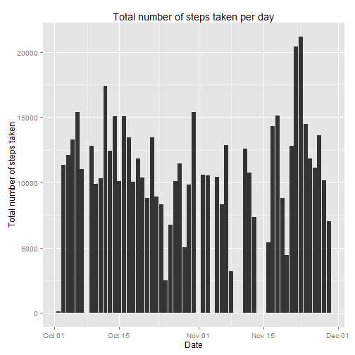
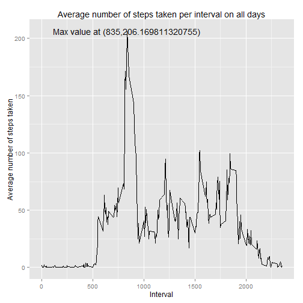

Reproducible Research: Peer Assessment 1
========================================================
This analysis makes use of data from a personal activity monitoring device.
This device collects data at 5 minute intervals through out the day. The data
consists of two months of data from an anonymous individual collected during
the months of October and November, 2012 and include the number of steps
taken in 5 minute intervals each day.


## Loading and preprocessing the data
This repository contains the dataset, hence there is not need to download 
it seperatly. The following code block downloads the activity.csv data into R

```r
library(plyr)
library(ggplot2)
library(xtable)

zipFile <- "activity.zip"
unzip(zipFile)
activityData <- read.csv("activity.csv")
```

Let's analyze the imported activityData fata.frame

```r
print(str(activityData))
```

```
## 'data.frame':	17568 obs. of  3 variables:
##  $ steps   : int  NA NA NA NA NA NA NA NA NA NA ...
##  $ date    : Factor w/ 61 levels "2012-10-01","2012-10-02",..: 1 1 1 1 1 1 1 1 1 1 ...
##  $ interval: int  0 5 10 15 20 25 30 35 40 45 ...
## NULL
```

After loading the dataset, it is apparent that the $date variable is of class
"factor". Hence, the following steps will convert it to type "date".
Note: Missing values coded as 'NA' are not handelled here and will be handelled in subsequent steps.

```r
activityData$date <-as.Date(activityData$date)
print(str(activityData))
```

```
## 'data.frame':	17568 obs. of  3 variables:
##  $ steps   : int  NA NA NA NA NA NA NA NA NA NA ...
##  $ date    : Date, format: "2012-10-01" "2012-10-01" ...
##  $ interval: int  0 5 10 15 20 25 30 35 40 45 ...
## NULL
```

Now we have a clean data set to work with.

## What is mean total number of steps taken per day?

Plotting the total steps taken each day

```r
activityData2 <-ddply(activityData, ~date , summarize, 
                      sum_steps = sum(steps),
                      mean_steps = mean(steps),
                      median_steps = median(steps)) 
g <- ggplot(activityData2, aes(x = date, y = sum_steps))
g <- g + geom_bar(stat="identity")
g <- g + xlab("Date") + ylab("Total number of steps taken") + labs(title = "Total number of steps taken per day")
print(g)
```

 

Displaying the mean and median steps taken each day

```r
print((activityData2))
```

```
##          date sum_steps mean_steps median_steps
## 1  2012-10-01        NA         NA           NA
## 2  2012-10-02       126     0.4375            0
## 3  2012-10-03     11352    39.4167            0
## 4  2012-10-04     12116    42.0694            0
## 5  2012-10-05     13294    46.1597            0
## 6  2012-10-06     15420    53.5417            0
## 7  2012-10-07     11015    38.2465            0
## 8  2012-10-08        NA         NA           NA
## 9  2012-10-09     12811    44.4826            0
## 10 2012-10-10      9900    34.3750            0
## 11 2012-10-11     10304    35.7778            0
## 12 2012-10-12     17382    60.3542            0
## 13 2012-10-13     12426    43.1458            0
## 14 2012-10-14     15098    52.4236            0
## 15 2012-10-15     10139    35.2049            0
## 16 2012-10-16     15084    52.3750            0
## 17 2012-10-17     13452    46.7083            0
## 18 2012-10-18     10056    34.9167            0
## 19 2012-10-19     11829    41.0729            0
## 20 2012-10-20     10395    36.0938            0
## 21 2012-10-21      8821    30.6285            0
## 22 2012-10-22     13460    46.7361            0
## 23 2012-10-23      8918    30.9653            0
## 24 2012-10-24      8355    29.0104            0
## 25 2012-10-25      2492     8.6528            0
## 26 2012-10-26      6778    23.5347            0
## 27 2012-10-27     10119    35.1354            0
## 28 2012-10-28     11458    39.7847            0
## 29 2012-10-29      5018    17.4236            0
## 30 2012-10-30      9819    34.0938            0
## 31 2012-10-31     15414    53.5208            0
## 32 2012-11-01        NA         NA           NA
## 33 2012-11-02     10600    36.8056            0
## 34 2012-11-03     10571    36.7049            0
## 35 2012-11-04        NA         NA           NA
## 36 2012-11-05     10439    36.2465            0
## 37 2012-11-06      8334    28.9375            0
## 38 2012-11-07     12883    44.7326            0
## 39 2012-11-08      3219    11.1771            0
## 40 2012-11-09        NA         NA           NA
## 41 2012-11-10        NA         NA           NA
## 42 2012-11-11     12608    43.7778            0
## 43 2012-11-12     10765    37.3785            0
## 44 2012-11-13      7336    25.4722            0
## 45 2012-11-14        NA         NA           NA
## 46 2012-11-15        41     0.1424            0
## 47 2012-11-16      5441    18.8924            0
## 48 2012-11-17     14339    49.7882            0
## 49 2012-11-18     15110    52.4653            0
## 50 2012-11-19      8841    30.6979            0
## 51 2012-11-20      4472    15.5278            0
## 52 2012-11-21     12787    44.3993            0
## 53 2012-11-22     20427    70.9271            0
## 54 2012-11-23     21194    73.5903            0
## 55 2012-11-24     14478    50.2708            0
## 56 2012-11-25     11834    41.0903            0
## 57 2012-11-26     11162    38.7569            0
## 58 2012-11-27     13646    47.3819            0
## 59 2012-11-28     10183    35.3576            0
## 60 2012-11-29      7047    24.4688            0
## 61 2012-11-30        NA         NA           NA
```


## What is the average daily activity pattern?


```r
activityData3 <-ddply(activityData, ~interval , summarize, 
                     mean_steps = mean(steps, na.rm = TRUE))
yMax<- max(activityData3[,2])
xMax <- activityData3[which.max(activityData3[,2]),1]
g <- ggplot(activityData3, aes(x = interval, y = mean_steps))
g <- g + geom_line()
labelValue <- paste("Max value at (", as.character(xMax), ",", yMax, ")", sep = "")
g <- g + annotate("text", x=xMax, y=yMax, label=labelValue)
g <- g + xlab("Interval") + ylab("Average number of steps taken") + labs(title = "Average number of steps taken per interval on all days")
print(g)
```

 

## Imputing missing values

### Strategy for dealing with missing values
Finding the total number of rows with missing values (coded as NA).

```r
summary(activityData)
```

```
##      steps            date               interval   
##  Min.   :  0.0   Min.   :2012-10-01   Min.   :   0  
##  1st Qu.:  0.0   1st Qu.:2012-10-16   1st Qu.: 589  
##  Median :  0.0   Median :2012-10-31   Median :1178  
##  Mean   : 37.4   Mean   :2012-10-31   Mean   :1178  
##  3rd Qu.: 12.0   3rd Qu.:2012-11-15   3rd Qu.:1766  
##  Max.   :806.0   Max.   :2012-11-30   Max.   :2355  
##  NA's   :2304
```


#Modify
from this we see that NA's only exist in the $steps variable and that there are "r numberNa" of them which constitues for 'r perncentNa' %.


```r
ddply(activityData, activityData[,1:2])
```

```
## Error: no applicable method for 'as.quoted' applied to an object of class
## "data.frame"
```


## Are there differences in activity patterns between weekdays and weekends?
